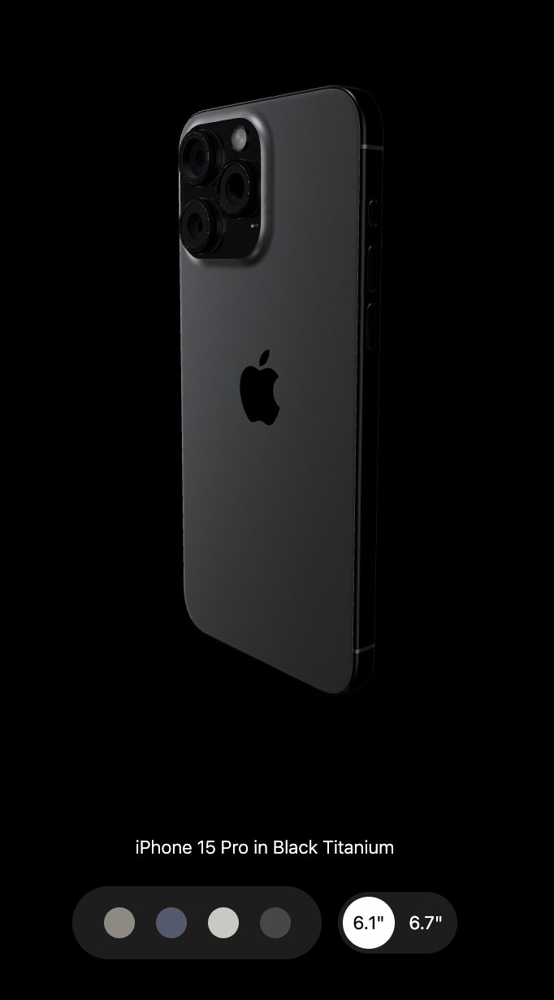

<div align="center">
  <h2 align="center">3D iPhone Website (ThreeJS/GSAP)</h2>
  <div>
    
    
    
    
  </div>

</div>

## <a name="introduction">🤖 Introduction</a>

Apple's iPhone 15 Pro website made with Vite using React.js and TailwindCSS. It highlights the effective use of GSAP (Greensock Animations) and Three.js for displaying iPhone 15 Pro models in various colors and shapes.

## <a name="tech-stack">⚙️ Tech Stack</a>

- Vite
- React.js
- Three.js
- React Three Fiber
- React Three Drei
- GSAP (Greensock)
- Tailwind CSS

## <a name="quick-start">🚀 Dependenices</a>

**Installing Packages**

```bash
npm i gsap @gsap/react three @react-three/drei @react-three/fiber
```

**Running the Project**

```bash
npm run dev
```

Open [http://localhost:5173](http://localhost:5173) in browser

## <a name="features">🔋 Features</a>

👉 **Subtle Smooth Animations using GSAP**: Enhanced user experience with seamless and captivating animations powered by GSAP.

👉 **3D Model Rendering with Different Colors and Sizes**: Dynamic 3D rendering of an iPhone, offering various color and size options.

👉 **Custom Video Carousel**: Interactive video carousel developed using GSAP for a personalized browsing experience.

👉 **Responsive design**: Consistent access and optimal viewing on any device.

## <a name="links">🔥 Deployement</a>

**Project Deployed on Vercel**

Open [http://iphonedevmax.vercel.app](http://iphonedevmax.vercel.app) to view



<!-- Gsap demo: https://github.com/JavaScript-Mastery-Pro/gsap-crash-course -->